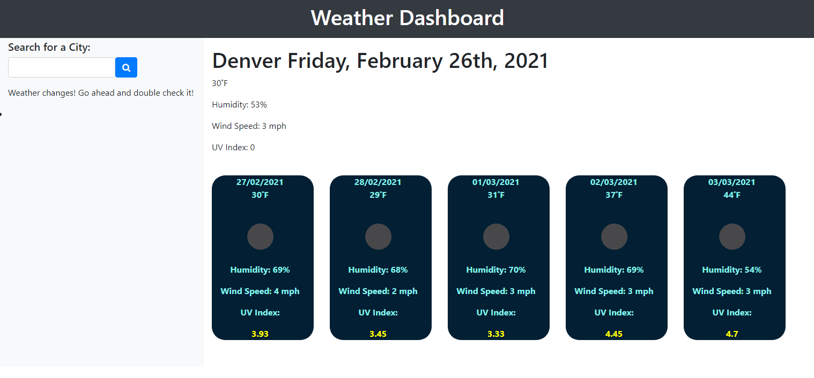

## Weather Dashboard

As a user I want to search for the weather of a given city, so that I know how to plan for the day and week ahead. I would like to see the current weather for the day, and a 5 day future forecast. I would like to be able to view multiple elements including but not limited to: temperature, wind speed, UVI, and humidity.
## Installation
Nothing is required of the User

## Usage
- When I enter the homepage I am greeted with the otption to search for a cities weather
- When I search by city
- I am given the weather for that city and the five day future forecast
- When I click on the name of a previously searched city
- I am taken to that cities weather

## License
- MIT License

## Screenshots

- Home Page/Weather Dash Intro

- Denver Weather

- Chicago Weather

## Features
1. Open Weather API
    https://openweathermap.org/api
2. BootStrap
    https://getbootstrap.com/docs/4.6/getting-started/introduction/

## Links
1. [github.io](https://nathanforgille.github.io/weather-dashboard/) 
2. [github](https://github.com/NathanForgille/weather-dashboard)

## Libraries
1. jQuery
2. BootStrap

## Credit
![Youtube video for date format manipulation]
- https://www.youtube.com/watch?v=SU1jqW-n9PI&ab_channel=CryptersInfotech
![Youtube video for capitalizing first letter and returning the rest of the word]
- https://www.youtube.com/watch?v=8IEI-7fj2j4&ab_channel=JuniorDeveloperCentral

## Authors
- Nathan Forgille